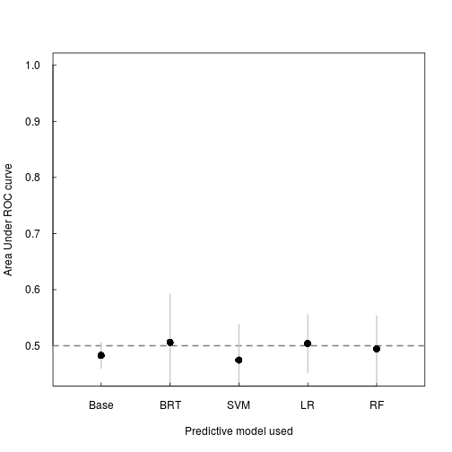
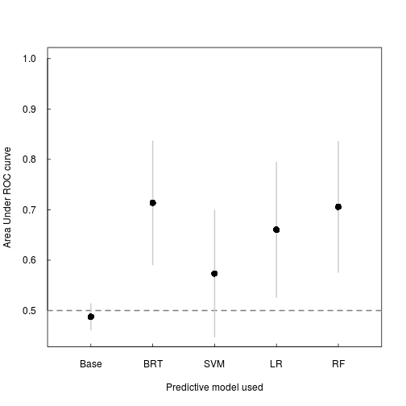

## Introduction


### Knowledge gap

Multi-host parasites are everywhere, but it's difficult to determine what hosts that some parasites are able to infect. Are there commonalities among parasitized host species that could allow for prediction of parasite spillover? We examine that here using fish-parasites as a case study. We train a series of models on parasites of fish species, and determine the predictive accuracy of these models.


### problems:
* Model is tested on the training set. There's not much data out there, especially on occurrences. 
* Absence data aren't true absences. Should I even train on these data if the model treats them as true absences?
* 


## Methods

### Data and processing
 what the data are (fish-parasite data obtained from FishBase, and Strona's FishPest database)
 data selection, row removal, and imputation
 
 
### Models used
 discuss baseline, all zero, and all one scenarios (my nulls), and then go into other algorithms used (brt, svm, lr, rf)


```r
# list of imputed data matrices
imputedData=list()

# storage for model outputs
baseline.auc=vector(); allone.auc=vector(); allzero.auc=vector()
brtModel=list(); brt.best.iter=list(); brt.preds=list(); brt.perf=list(); brt.perfAUC=vector()
svmModel=list(); svm.preds=list(); svm.perf=list(); svm.perfAUC=vector()
lrModel=list(); lr.preds=list(); lr.perf=list(); lr.perfAUC=vector()
rfModel=list(); rf.preds=list(); rf.perf=list(); rf.perfAUC=vector()


for(i in 1:nrow(freshMatrix3)){
#data imputation
  dat = getPointsObject(freshMatrix3[i,], FT)
  dat = rfImpute(dat[,-1], dat[,1])
  imputedData[[i]] = dat
  
  pres=which(dat[,1]==1)
  inds=sample(1:nrow(dat), 0.7*nrow(dat))
  if(sum(pres %in% inds) < 4){inds[1:4]=pres[1:4]}
  
  train = dat[inds,]
  test = dat[-inds,]
  
  #baseline expectations and null models
  baseline.auc[i] = performance(prediction(test[sample(1:nrow(test), nrow(test)),1], test[,1]), 'auc')@y.values
   
 ##trained models
  #boosted regression trees
  weights=1/(sum(train[,1])/nrow(train))
  brtModel[[i]] = gbm(train[,1] ~ ., data=train[,-1], n.trees=60000, interaction.depth=4, distribution='bernoulli', weights=1+(train[,1] * weights))
  brt.best.iter[[i]] = gbm.perf(brtModel[[i]], method="OOB")
  brt.preds[[i]] = prediction(predict(brtModel[[i]], newdata=test[,-1], n.trees=brt.best.iter[[i]]), test[,1])
    brt.perf[[i]] = performance(brt.preds[[i]],"tpr","fpr")
  brt.perfAUC[i]=unlist(performance(brt.preds[[i]], 'auc')@y.values)

  #support vector machines
  svmModel[[i]] = svm(train[,1] ~ ., data=train[,-1], cross=2, probability=TRUE)
  svm.preds[[i]] = prediction(predict(svmModel[[i]], test[,-1]), test[,1])
  svm.perf[[i]] = performance(svm.preds[[i]],"tpr","fpr")
  svm.perfAUC[i] = unlist(performance(svm.preds[[i]], 'auc')@y.values)

  #logistic regression
  lrModel[[i]] = glm(train[,1] ~ ., data=train[,-1], family=binomial)
  lr.preds[[i]] = prediction(predict(lrModel[[i]], test[,-1]), test[,1])
  lr.perf[[i]] = performance(lr.preds[[i]],"tpr","fpr")
  lr.perfAUC[i] = unlist(performance(lr.preds[[i]], 'auc')@y.values)

  #random forest
  rfModel[[i]] = randomForest(train[,1] ~ ., data=train[,-1])
  rf.preds[[i]] = prediction(predict(rfModel[[i]], test[,-1]), test[,1])
  rf.perf[[i]] = performance(rf.preds[[i]],"tpr","fpr")
  rf.perfAUC[i] = unlist(performance(rf.preds[[i]], 'auc')@y.values)
  
  print(i)
}
```


```r
baseline.auc=unlist(baseline.auc)
#allzero.auc=unlist(allzero.auc)
#allone.auc=unlist(allone.auc)

aucs=cbind(baseline.auc, brt.perfAUC, svm.perfAUC, lr.perfAUC, rf.perfAUC)
colnames(aucs)=c('base', 'brt', 'svm', 'logr', 'rf')

meanAUC=colMeans(aucs)
meanSE = apply(aucs,2,sd) / sqrt(nrow(aucs))
meanSD = apply(aucs,2,sd)
  
plot(1:5, meanAUC, ylim=c(0.45, 1), xlim=c(0.5,5.5), las=1, pch=16, tck=0.01, xaxt='n', xlab='Predictive model used', ylab='Area Under ROC curve')
abline(h=0.5, col=grey(0.5), lty=2, lwd=2)
segments(x0=1:5, y0=meanAUC+meanSD, y1=meanAUC-meanSD, col=grey(0.8),lwd=2)
points(1:5, meanAUC, pch=16, cex=1.5)
axis(1, at=1:5, labels=c('Base', 'BRT', 'SVM', 'LR', 'RF'), tck=0.01, srt=30)
```

 


```r
# list of imputed data matrices
m.imputedData=list()

# storage for model outputs
m.baseline.auc=vector(); m.allone.auc=vector(); m.allzero.auc=vector()
m.brtModel=list(); m.brt.best.iter=list(); m.brt.preds=list(); m.brt.perf=list(); m.brt.perfAUC=vector()
m.svmModel=list(); m.svm.preds=list(); m.svm.perf=list(); m.svm.perfAUC=vector()
m.lrModel=list(); m.lr.preds=list(); m.lr.perf=list(); m.lr.perfAUC=vector()
m.rfModel=list(); m.rf.preds=list(); m.rf.perf=list(); m.rf.perfAUC=vector()


for(i in 1:nrow(marineMatrix3)){
#data imputation
  dat = getPointsObject(marineMatrix3[i,], MT)
  dat = rfImpute(dat[,-1], dat[,1])
  m.imputedData[[i]] = dat
    
  pres=which(dat[,1]==1)
  inds=sample(1:nrow(dat), 0.7*nrow(dat))
  if(sum(pres %in% inds) < 4){inds[1:4]=pres[1:4]}
  train = dat[inds,]
  test = dat[-inds,]
  
  #baseline expectations and null models
  m.baseline.auc[i] = performance(prediction(test[sample(1:nrow(test), nrow(test)),1], test[,1]), 'auc')@y.values
   
 ##trained models
  #boosted regression trees
  weights=1 / (sum(train[,1])/nrow(train))
  m.brtModel[[i]] = gbm(train[,1] ~ ., data=train[,-1], n.trees=60000, interaction.depth=4, distribution='bernoulli', weights=1+(train[,1] * weights))
  m.brt.best.iter[[i]] = gbm.perf(m.brtModel[[i]], method="OOB")
  m.brt.preds[[i]] = prediction(predict(m.brtModel[[i]],newdata=test[,-1],n.trees=m.brt.best.iter[[i]]), test[,1])
  m.brt.perf[[i]] = performance(m.brt.preds[[i]],"tpr","fpr")
  m.brt.perfAUC[i]=unlist(performance(m.brt.preds[[i]], 'auc')@y.values)

  #support vector machines
  m.svmModel[[i]] = svm(train[,1] ~ ., data=train[,-1])
  m.svm.preds[[i]] = prediction(predict(m.svmModel[[i]], test[,-1]), test[,1])
  m.svm.perf[[i]] = performance(m.svm.preds[[i]],"tpr","fpr")
  m.svm.perfAUC[i] = unlist(performance(m.svm.preds[[i]], 'auc')@y.values)

  #logistic regression
  m.lrModel[[i]] = glm(train[,1] ~ ., data=train[,-1], family=binomial)
  m.lr.preds[[i]] = prediction(predict(m.lrModel[[i]], test[,-1]), test[,1])
  m.lr.perf[[i]] = performance(m.lr.preds[[i]],"tpr","fpr")
  m.lr.perfAUC[i] = unlist(performance(m.lr.preds[[i]], 'auc')@y.values)

  #random forest
  m.rfModel[[i]] = randomForest(train[,1] ~ ., data=train[,-1])
  m.rf.preds[[i]] = prediction(predict(m.rfModel[[i]], test[,-1]), test[,1])
  m.rf.perf[[i]] = performance(m.rf.preds[[i]],"tpr","fpr")
  m.rf.perfAUC[i] = unlist(performance(m.rf.preds[[i]], 'auc')@y.values)
  
  print(i)
}
```


```r
m.baseline.auc=unlist(m.baseline.auc)
#m.allzero.auc=unlist(m.allzero.auc)
#m.allone.auc=unlist(m.allone.auc)

m.aucs=cbind(m.baseline.auc, m.brt.perfAUC, m.svm.perfAUC, m.lr.perfAUC, m.rf.perfAUC)
colnames(m.aucs)=c('base', 'brt', 'svm', 'logr', 'rf')

m.meanAUC=colMeans(m.aucs)
m.meanSE = apply(m.aucs,2,sd) / sqrt(nrow(m.aucs))
m.meanSD = apply(m.aucs,2,sd)
  
plot(1:5, m.meanAUC, ylim=c(0.45, 1), xlim=c(0.5,5.5), las=1, pch=16, tck=0.01, xaxt='n', xlab='Predictive model used', ylab='Area Under ROC curve')
abline(h=0.5, col=grey(0.5), lty=2, lwd=2)
segments(x0=1:5, y0=m.meanAUC+m.meanSD, y1=m.meanAUC-m.meanSD, col=grey(0.8),lwd=2)
points(1:5, m.meanAUC, pch=16, cex=1.5)
axis(1, at=1:5, labels=c('Base', 'BRT', 'SVM', 'LR', 'RF'), tck=0.01, srt=30)
```

 


## Results

## Discussion
